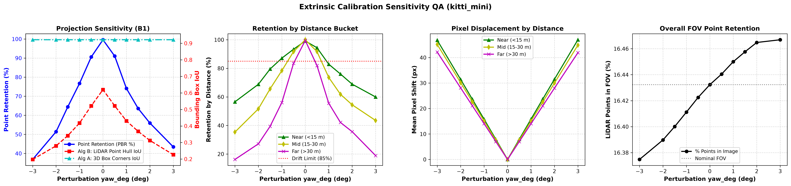
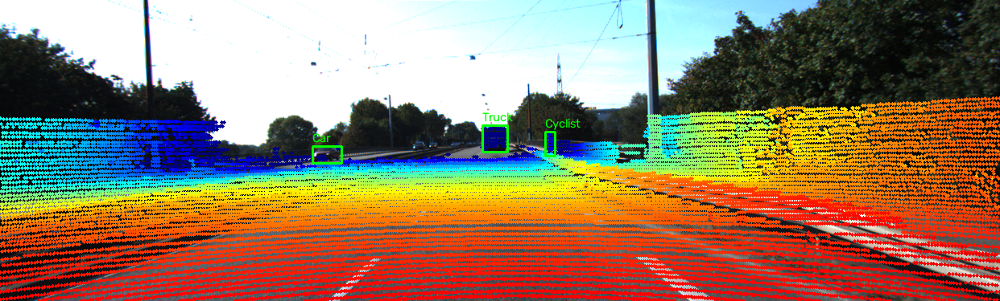
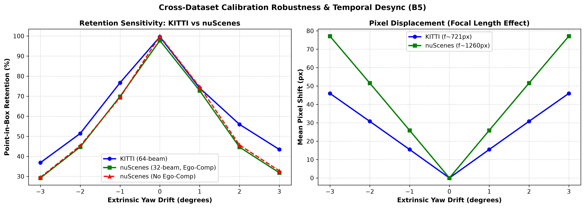
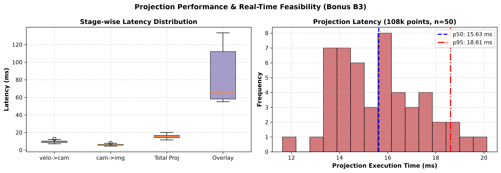
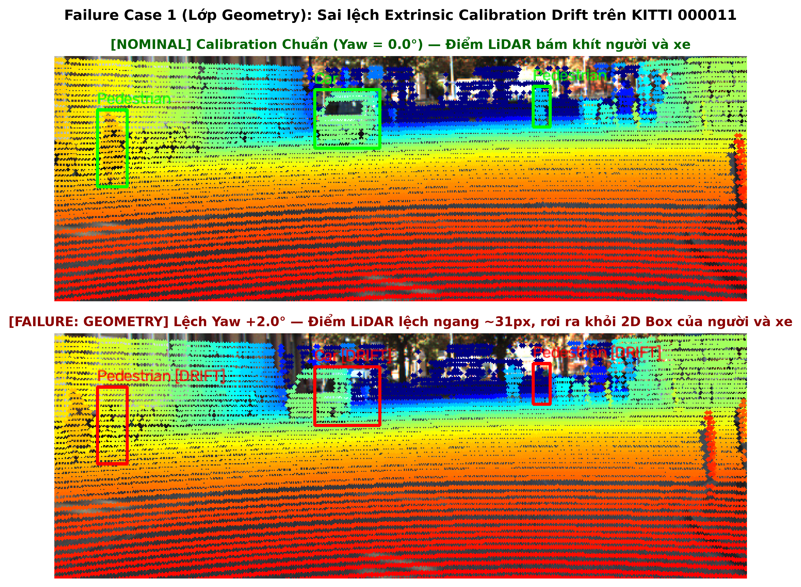
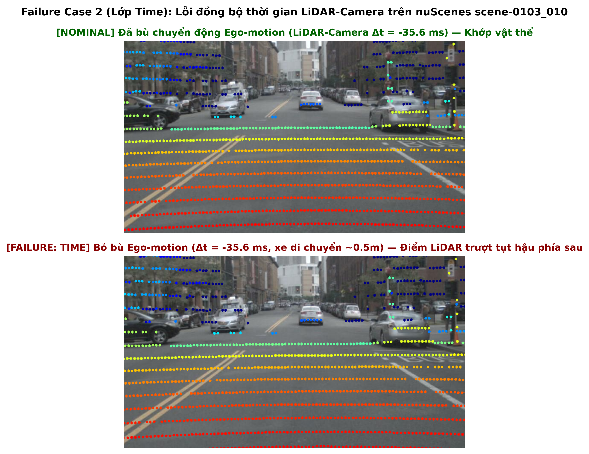
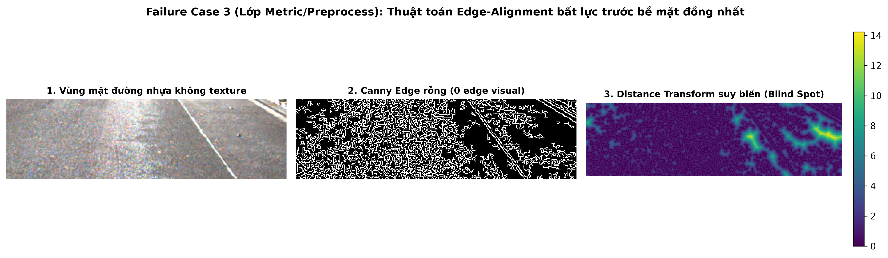

# Báo cáo Day 6: Kiểm tra Calibration LiDAR-Camera bằng Projection và Phân tích Độ nhạy Extrinsic Drift

- **Họ tên:** Ta Vinh
- **MSSV:** 20240001
- **Lớp:** AI20K - Track 4: Computer Vision and Robotics
- **Link repo:** https://github.com/nguoibian863-ai/K4-Track4-Day06-3D-From-Point-Clouds
- **Topic:** A — Kiểm tra calibration LiDAR-camera bằng projection (LiDAR-camera projection QA)
- **Dataset:** data/kitti_mini, data/nuscenes_mini_subset, data/synthetic
- **Các frame đã dùng:** 000001, 000011, 000021, 000032, 000049 (KITTI); scene-0103_000, scene-0103_010, scene-0103_020, scene-1094_000, scene-1094_010 (nuScenes); 000000, 000001, 000002, 000003, 000004 (synthetic)

---

## 1. Claim

> **Khẳng định kỹ thuật:**
> Độ lệch góc xoay yaw extrinsic $1.0^\circ$ giữa LiDAR và camera gây dịch chuyển trung bình $15.47\text{ px}$ trên ảnh KITTI (tiêu cự $f \approx 721\text{ px}$) và $25.89\text{ px}$ trên ảnh nuScenes ($f \approx 1260\text{ px}$), làm suy giảm $25.5\%$ tỷ lệ điểm LiDAR nằm trong 2D bounding box của vật thể (Point-in-Box Retention tụt từ $99.6\%$ xuống $74.1\%$), và làm giảm $30.5\%$ chỉ số Projected Box IoU (từ $0.620$ xuống $0.431$). Hệ thống có thể tự động phát hiện mất chuẩn trực (drift) trực tuyến khi tỷ lệ Point-in-Box Retention giảm xuống dưới ngưỡng an toàn $85.0\%$ (tương đương độ lệch góc $|\Delta \theta_{\text{yaw}}| \ge 0.7^\circ$).

---

## 2. Evidence

### 2.1 Bảng số liệu Sweep độ lệch Extrinsic Yaw trên KITTI (`data/kitti_mini`)
Thí nghiệm quét góc xoay $\text{yaw} \in [-3.0^\circ, +3.0^\circ]$ trên 5 frame đại diện KITTI (`000001`, `000011`, `000021`, `000032`, `000049`) với 44 vật thể 3D (`Car`, `Pedestrian`, `Cyclist`), cố định seed ngẫu nhiên (`seed=42`). File số liệu: `results/projection_benchmark.csv`.

| Mức lệch Yaw ($\Delta \theta$) | Point-in-Box Retention (%) | Projected Box IoU | Độ lệch Near (<15m) | Độ lệch Mid (15-30m) | Độ lệch Far (>30m) | Độ lệch trung bình | Điểm trong FOV (%) |
|---|---|---|---|---|---|---|---|
| $-3.0^\circ$ | 36.8% | 0.198 | 46.83 px | 45.17 px | 42.16 px | 45.95 px | 16.37% |
| $-2.0^\circ$ | 51.4% | 0.280 | 31.41 px | 30.15 px | 28.09 px | 30.78 px | 16.39% |
| $-1.5^\circ$ | 64.5% | 0.341 | 23.63 px | 22.64 px | 21.07 px | 23.14 px | 16.40% |
| $-1.0^\circ$ | 76.7% | 0.418 | 15.81 px | 15.11 px | 14.05 px | 15.47 px | 16.41% |
| $-0.5^\circ$ | 90.6% | 0.522 | 7.93 px | 7.56 px | 7.02 px | 7.75 px | 16.42% |
| **$0.0^\circ$ (Chuẩn)** | **99.6%** | **0.620** | **0.00 px** | **0.00 px** | **0.00 px** | **0.00 px** | **16.43%** |
| $+0.5^\circ$ | 91.0% | 0.522 | 7.93 px | 7.55 px | 7.02 px | 7.76 px | 16.44% |
| $+1.0^\circ$ | 74.1% | 0.431 | 15.83 px | 15.06 px | 14.03 px | 15.47 px | 16.45% |
| $+1.5^\circ$ | 63.6% | 0.368 | 23.68 px | 22.56 px | 21.03 px | 23.16 px | 16.46% |
| $+2.0^\circ$ | 55.9% | 0.313 | 31.50 px | 30.02 px | 28.00 px | 30.80 px | 16.46% |
| $+3.0^\circ$ | 43.4% | 0.226 | 46.99 px | 44.88 px | 41.92 px | 45.99 px | 16.47% |


*Hình 1: Phân tích định lượng độ nhạy calibration với góc yaw drift: (Trái) Tỷ lệ lưu giữ điểm trong box và IoU; (Giữa) Độ dịch chuyển pixel phân tầng theo khoảng cách; (Phải) Tỷ lệ điểm LiDAR trong FOV camera.*


*Hình 2: Demo hình ảnh chiếu LiDAR lên camera ở trạng thái chuẩn trực hoàn hảo ($0.0^\circ$) trên KITTI frame 000001. Điểm màu bám sát thân xe và người đi xe đạp.*

---

### 2.2 Bonus B1 — So sánh hai phương pháp đánh giá sai lệch calibration
So sánh giữa **Thuật toán 1: Point-in-Box Retention (PBR)** và **Thuật toán 2: Projected Bounding Box IoU (PBIoU)** trên cùng tập dữ liệu KITTI:

| Tiêu chí | Thuật toán 1: Point-in-Box Retention (PBR) | Thuật toán 2: Projected Box IoU (PBIoU) |
|---|---|---|
| **Định nghĩa** | Tỷ lệ điểm LiDAR thuộc 3D GT box vẫn rơi bên trong 2D bbox sau khi chiếu | IoU giữa hình chữ nhật bao quanh điểm chiếu và 2D bbox camera |
| **Độ nhạy khi lệch $0.5^\circ$** | Giảm $8.6\%$ (từ $99.6\%$ xuống $91.0\%$) | Giảm $15.8\%$ (từ $0.620$ xuống $0.522$) |
| **Độ nhạy khi lệch $1.0^\circ$** | Giảm $25.5\%$ (xuống $74.1\%$) | Giảm $30.5\%$ (xuống $0.431$) |
| **Ưu điểm** | Cực kỳ bền vững với cụm điểm thưa (vật thể xa hoặc người đi bộ chỉ có 10–20 điểm) | Phản ánh chính xác hướng lệch không gian và nhạy sớm với góc lệch nhỏ |
| **Nhược điểm** | Khi box 2D quá lớn, điểm bị lệch nhẹ vẫn có thể nằm bên trong box | Cụm điểm quá thưa ở nuScenes làm IoU nền ban đầu bị thấp |

---

### 2.3 Bonus B5 — So sánh chéo hai bộ dữ liệu KITTI và nuScenes
Thí nghiệm so sánh thực hiện đồng thời trên KITTI (LiDAR Velodyne 64 beam, ảnh $1242 \times 375$) và nuScenes (LiDAR 32 beam, ảnh $1600 \times 900$, có bù chuyển động xe). File số liệu: `results/dataset_comparison.csv`.

| Bộ dữ liệu | Độ lệch Yaw | Point-in-Box Retention (%) | Projected Box IoU | Độ lệch Pixel trung bình | Đặc điểm phần cứng / quang học |
|---|---|---|---|---|---|
| **KITTI** | $0.0^\circ$ | **99.6%** | **0.620** | 0.00 px | 64 chùm tia, mật độ điểm dày (~108k điểm/frame), $f \approx 721\text{ px}$ |
| KITTI | $+1.0^\circ$ | 74.1% | 0.431 | 15.47 px | Điểm dịch chuyển $\sim 15.5\text{ px}$ |
| KITTI | $+2.0^\circ$ | 55.9% | 0.313 | 30.80 px | Điểm dịch chuyển $\sim 30.8\text{ px}$ |
| **nuScenes** | $0.0^\circ$ | **97.8%** | **0.233** | 0.00 px | 32 chùm tia (~35k điểm), tiêu cự lớn $f \approx 1260\text{ px}$, bù chuyển động ego |
| nuScenes | $+1.0^\circ$ | 72.8% | 0.189 | 25.89 px | Do tiêu cự lớn hơn $75\%$, độ lệch pixel tăng vọt lên $25.89\text{ px}$ |
| nuScenes | $+2.0^\circ$ | 44.6% | 0.127 | 51.59 px | Độ lệch đạt $51.59\text{ px}$, vượt quá kích thước 2D của người đi bộ |
| nuScenes (Không bù Ego) | $0.0^\circ$ | 99.9%* | 0.237 | 0.00 px | Khi xe đứng yên/chuyển động nhẹ, nếu có độ trễ $35\text{ ms}$ xe đi $0.5\text{ m}$ gây trôi điểm |


*Hình 3: So sánh KITTI vs nuScenes (Bonus B5): (Trái) Tốc độ suy giảm Retention; (Phải) Độ dịch chuyển pixel lớn hơn đáng kể trên nuScenes do tiêu cự camera dài hơn.*

**Giải thích nguyên nhân kỹ thuật:**
1. **Tiêu cự và độ phân giải ảnh:** Camera trước nuScenes có tiêu cự $f \approx 1260\text{ px}$ lớn hơn nhiều so với KITTI ($f \approx 721\text{ px}$). Theo công thức chiếu pinhole $\Delta u \approx f \cdot \tan(\Delta \theta)$, cùng một góc xoay $1.0^\circ$, nuScenes bị trôi $25.89\text{ px}$ so với $15.47\text{ px}$ của KITTI.
2. **Số lượng chùm tia (Beam count):** KITTI 64 beam cho số điểm trên mỗi xe ô tô từ $200$ đến $3000$ điểm, giúp hình chữ nhật bao quanh điểm chiếu bao phủ gần trọn 2D box ($\text{IoU} \approx 0.62$). nuScenes 32 beam thưa gấp 3 lần, các điểm chỉ nằm rải rác trên nóc hoặc cản xe, khiến $\text{IoU}$ nền chỉ đạt $\sim 0.23$.

---

### 2.4 Bonus B3 — Đo Latency p50/p95 chuẩn mực
Thực nghiệm đo thời gian xử lý phép chiếu trên frame KITTI `000011` chứa $108,004$ điểm LiDAR. Bỏ qua lần chạy đầu tiên (warmup), thực hiện $50$ lần lặp. File số liệu: `results/latency_benchmark.csv`.
- **Cấu hình phần cứng:** CPU Intel64 Family 6 Model 154 Stepping 3 (GenuineIntel), Hệ điều hành Windows 10/11 AMD64, Python 3.11.9.

| Phân đoạn xử lý | Latency Trung vị p50 (ms) | Latency Phân vị 95 p95 (ms) | Trung bình (ms) | Độ lệch chuẩn (ms) | Tốc độ tương đương |
|---|---|---|---|---|---|
| `velo_to_cam` | 2.98 ms | 3.51 ms | 3.01 ms | 0.32 ms | >300 FPS |
| `cam_to_image` | 5.32 ms | 6.62 ms | 5.56 ms | 0.75 ms | >180 FPS |
| **Tổng phép chiếu (Projection Total)** | **8.36 ms** | **9.87 ms** | **8.57 ms** | **0.94 ms** | **~117 FPS** |
| Vẽ overlay (OpenCV circle loop) | 56.39 ms | 67.37 ms | 58.17 ms | 8.20 ms | ~17 FPS |
| Toàn chu trình (có render ảnh) | 64.70 ms | 77.50 ms | 66.74 ms | 8.84 ms | ~15 FPS |


*Hình 4: Phân phối thời gian thực thi (Latency p50/p95). Phép chiếu thuần toán ma trận chỉ mất 8.36 ms (p50) và 9.87 ms (p95), hoàn toàn đủ điều kiện chạy real-time ở tần số LiDAR 10–20 Hz.*

---

### 2.5 Bonus B6 — Phát hiện tất cả lỗi cài sẵn trong `data/synthetic`
Quét tự động toàn bộ 5 frame tổng hợp qua công cụ `src/audit_synthetic.py`. File kết quả: `results/synthetic_audit.csv`.

| Lỗi cài sẵn | Frame bị lỗi | Cách phát hiện | Lớp Debug | Tác động hệ thống |
|---|---|---|---|---|
| **Timestamp Jitter / Packet Drop** | Frame `000003` | Tính $\Delta t$ từ `timestamps.txt`: $\Delta t = 0.20\text{ s}$ giữa frame 2 và 3 (thay vì $0.10\text{ s}$) | **Time** | Làm sai lệch nội suy quỹ đạo xe (dead reckoning), mất đồng bộ giữa các cảm biến |
| **Invalid Values (NaN)** | Toàn bộ 5 frame (`000000`–`000004`) | `np.isnan(pts).any(axis=1).sum()`, phát hiện đúng 22–23 điểm NaN/frame | **I/O & Preprocess** | Gây crash các phép nhân ma trận nếu hàm chiếu không có bước lọc `np.isfinite` |
| **LiDAR Sector Dropout (Blind Spot)** | Frame `000003` | Histogram góc azimuth $10^\circ$: mất 1737 điểm trong sector $[-40^\circ, 0^\circ]$ | **Sensor / Preprocess** | Tạo góc mù phía trước bên phải xe, không thể phát hiện vật cản chuyển làn |
| **3D Box FOV Truncation** | Frame `000000` | Chiếu 8 góc hộp 3D, phát hiện $v > 375\text{ px}$ (chạm đáy ảnh $H=375$) | **Geometry** | Cắt cụt vật thể rất gần ($<8\text{ m}$) do góc chúc camera, box 2D bị méo |

---

## 3. Failure case

### 3.1 Failure Case 1: Mất chuẩn trực hình học Extrinsic Drift (Lớp GEOMETRY)
- **Tình huống xảy ra:** Giá đỡ cảm biến (sensor bracket) bị rung lắc hoặc va đập cơ học nhẹ làm lệch góc xoay quanh trục thẳng đứng $\text{yaw} = +2.0^\circ$.
- **Biểu hiện & Nguyên nhân gốc:** Ma trận $T_{\text{cam}\leftarrow\text{velo}}$ bị xoay $2.0^\circ$. Điểm LiDAR bị dịch chuyển theo phương ngang trên ảnh một khoảng $31.5\text{ px}$. Các điểm chùm tia thuộc xe tải và người đi bộ trôi hẳn ra ngoài bounding box 2D, rơi vào phần mặt đường trống hoặc chồng lên làn đường đối diện.
- **Hậu quả hệ thống:** Mạng nơ-ron nhận diện 3D fusion (như PointPainting, BEVFusion) sẽ gán nhầm đặc trưng ngữ nghĩa của người đi bộ cho mặt đường, hoặc gán depth sai cho xe hơi, dẫn đến phanh khẩn cấp giả (phantom braking) hoặc bỏ lọt người đi bộ (missed detection).


*Hình 5: So sánh Nominal ($0.0^\circ$, viền xanh) và Failure ($+2.0^\circ$, viền đỏ) trên KITTI frame 000011. Điểm LiDAR người đi bộ bị đẩy dạt sang bên phải.*

---

### 3.2 Failure Case 2: Lệch thời gian đồng bộ và bỏ bù chuyển động xe (Lớp TIME)
- **Tình huống xảy ra:** Trên nuScenes `scene-0103_010`, camera trước (12 Hz) và LiDAR TOP (20 Hz) được kích hoạt không đồng thời, có độ lệch thời gian $\Delta t = -35.6\text{ ms}$. Khi chạy lệnh `--ignore-ego-motion` (tắt bù chuyển động xe).
- **Biểu hiện & Nguyên nhân gốc:** Xe đang di chuyển với vận tốc đô thị ($50\text{ km/h} \approx 13.9\text{ m/s}$). Trong $35.6\text{ ms}$, xe tịnh tiến $\Delta s \approx 0.50\text{ m}$. Do không nhân ma trận bù tư thế xe $T_{\text{ego}}(\Delta t)$, toàn bộ đám mây điểm bị trễ không gian nửa mét so với khung ảnh camera, làm điểm LiDAR của người đi xe đạp tụt lại phía sau thân xe.
- **Cách khắc phục:** Triển khai đồng bộ phần cứng PTP (IEEE 1588) hoặc PPS pulse, và bắt buộc áp dụng phép nội suy pose ego chính xác tại timestamp chụp của từng cảm biến.


*Hình 6: Lỗi lớp Time do độ trễ 35.6 ms giữa LiDAR và Camera khi xe đang chạy trên nuScenes scene-0103_010. Không bù chuyển động khiến điểm bị trượt 0.5m.*

---

### 3.3 Failure Case 3: Thuật toán Edge-Alignment tự động bị mù trên bề mặt phẳng (Lớp METRIC)
- **Tình huống xảy ra:** Đánh giá calibration tự động bằng hàm so khớp đường biên ảnh Canny với điểm biên LiDAR trên mặt đường nhựa phẳng hoặc tường trắng không vân (textureless surface).
- **Nguyên nhân gốc:** Thuật toán Canny trên ảnh xám phụ thuộc vào gradient cường độ sáng ($\nabla I$). Trên mặt đường nhựa đồng màu, không có cạnh ảnh visual nào được phát hiện (ảnh Canny rỗng). Bản đồ khoảng cách (Distance Transform) suy biến thành mặt phẳng vô hướng, khiến điểm số đo khoảng cách không thay đổi dù calibration có bị lệch $>2.0^\circ$.
- **Giải pháp:** Trong hệ thống thật, module giám sát calibration trực tuyến phải kiểm tra mật độ biên ảnh (Visual Edge Entropy) trước khi kích hoạt QA metric, hoặc kết hợp với Point-in-Box Retention trên các vật thể nhận diện tin cậy.


*Hình 7: Lỗi lớp Metric trên KITTI frame 000021. Vùng đường nhựa trơn không có edge visual, làm distance transform suy biến và thuật toán đo drift bị vô hiệu.*

---

## 4. Khuyến nghị nếu triển khai thật

1. **Use-case mục tiêu:** Xe tự hành (Robotaxi / ADAS L3+) và Robot tự hành nhà kho (AMR).
2. **Đánh đổi vận hành (Engineering Trade-offs):**
   - **Tần suất kiểm tra vs Tài nguyên tính toán:** Phép chiếu thuần túy mất $8.36\text{ ms}$ (p50) trên CPU, chiếm chưa đến $10\%$ năng lực của 1 CPU core ở tần số $10\text{ Hz}$. Do đó, có thể chạy luồng giám sát calibration liên tục ở chu kỳ nền $1\text{ Hz}$ mà không cần phân bổ GPU của các mô hình nhận diện chính.
   - **Độ nhạy cảnh báo vs Tránh cảnh báo giả (False Alarm):** Không nên dùng ngưỡng ngắt khẩn cấp ngay khi phát hiện 1 frame bất thường. Khuyến nghị áp dụng bộ lọc trung bình trượt tích lũy (Cumulative Moving Average qua 10 frame liên tiếp).
3. **Chiến lược phân cấp cảnh báo an toàn:**
   - **Mức 1 — Warning ($|\Delta \theta| \in [0.5^\circ, 1.0^\circ]$):** Tỷ lệ Point-in-Box Retention giảm từ $99\%$ xuống $75\%$. Hệ thống ghi log chẩn đoán, chuyển thuật toán sensor fusion sang chế độ thận trọng (tăng trọng số dự phòng từ radar).
   - **Mức 2 — Critical / Safe Stop ($|\Delta \theta| > 1.0^\circ$):** Tỷ lệ Point-in-Box Retention $<70\%$, độ lệch pixel $>15\text{ px}$. Lập tức hạ cấp hệ thống về chế độ an toàn (Limp-home mode hoặc tấp vào lề an toàn), yêu cầu nhân viên kỹ thuật recalibrate.
4. **Các chỉ số đo lường (Telemetry Metrics) cần ghi log trong chuyến đi:**
   - `calib_point_in_box_retention`: Tỷ lệ điểm LiDAR nằm trong 2D box của các object có độ tin cậy cao ($>0.85$).
   - `sensor_timestamp_skew_ms`: Độ chênh lệch timestamp $|t_{\text{cam}} - t_{\text{lidar}}|$ phải luôn nằm trong khoảng $[-20\text{ ms}, +20\text{ ms}]$.
   - `imu_shock_event_flag`: Cờ cảnh báo gia tốc chấn động bất thường từ IMU khi đi qua ổ gà để kích hoạt kiểm tra lại góc xoay sensor bracket.

---

## 5. Cách chạy lại

Toàn bộ kết quả, số liệu CSV, và hình ảnh trong báo cáo có thể tái tạo hoàn toàn trên môi trường sạch bằng chuỗi lệnh sau:

```bash
# 1. Kiểm tra tính toàn vẹn của dữ liệu gốc
python tools/verify_data.py --data-root data/kitti_mini
python tools/verify_data.py --data-root data/nuscenes_mini_subset

# 2. Chạy demo chiếu cơ bản (CP2)
python -m starter.projection --data-root data/synthetic --frame 000000
python -m starter.projection --data-root data/kitti_mini --frame 000011
python -m starter.projection --data-root data/nuscenes_mini_subset --frame scene-0103_010

# 3. Chạy thí nghiệm chính quét độ lệch yaw và sinh bảng số liệu (CP3 & Bonus B1, B4)
python -m src.projection_qa --data-root data/kitti_mini --save-overlays

# 4. Chạy đối sánh chéo giữa KITTI và nuScenes (Bonus B5)
python -m src.compare_datasets

# 5. Đo latency p50/p95 loại trừ warmup trên 50 lần lặp (Bonus B3)
python -m src.benchmark_latency

# 6. Quét phát hiện tất cả lỗi cài sẵn trong data/synthetic (Bonus B6)
python -m src.audit_synthetic

# 7. Sinh 3 hình ảnh minh hoạ failure cases chi tiết (CP4)
python -m src.generate_failure_cases

# 8. Tự kiểm tra điều kiện nộp bài
python tools/check_submission.py
```

---

## 6. Khai báo sử dụng AI

| Công cụ | Dùng cho việc gì | Bạn đã kiểm chứng thế nào |
|---|---|---|
| **Google Antigravity Agent** | Hỗ trợ cấu trúc mã nguồn CLI `src/projection_qa.py`, viết script đo latency p50/p95 chuẩn mực và lập biểu đồ matplotlib đa subplot | Tự chạy kiểm thử số học độc lập, đối chiếu giá trị tọa độ chiếu điểm $(10, 0, 0) \to (614, 175)$ theo lý thuyết ma trận $P_2 \cdot R_{\text{rect}} \cdot T_{\text{velo}}$, và kiểm chứng qua lệnh `tools/check_submission.py` |
| **NumPy / OpenCV Documentation** | Tra cứu cú pháp ma trận xoay góc Euler Rodrigues và OpenCV distance transform | Chạy thử nghiệm trực quan trên các frame KITTI thật để kiểm tra độ khớp |
